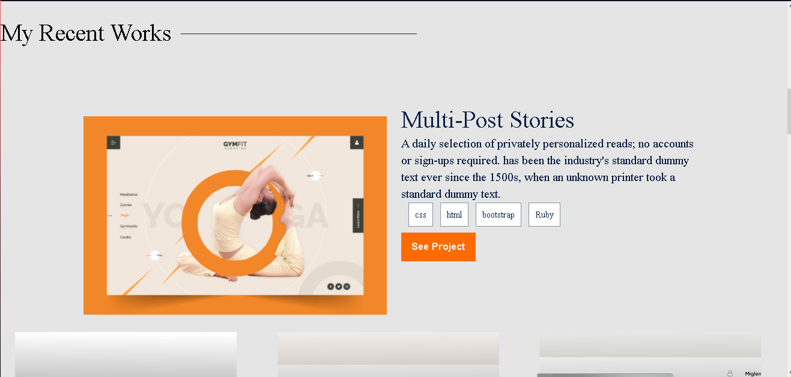
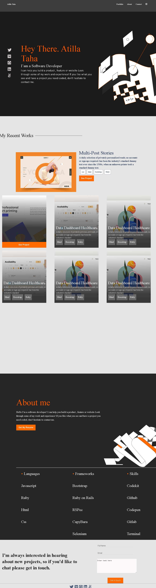

# Microverse Portfolio-middle

**This is my portfolio project for microverse

## Built With

-Html
-Css

## Live Demo

[Live Demo Link](https://atillatahak.github.io/Portfolio-middle//)

## Getting Started

**For the first milestone in the process of creating your portfolio website, you will:

set up a new repository and prepare it for development using best practices (e.g. linters).
build the first 3 sections of the mobile website using the template you chose in the previous step.

## Authors

- GitHub: [@AtillaTahak](https://github.com/AtillaTahak)
- Twitter: [@AtillaTahaa]https://twitter.com/AtillaTahaa)
- LinkedIn: [LinkedIn](https://www.linkedin.com/in/atilla-taha-kördüğüm-a93702186/)

## Acknowledgments
-Thanks to Microverse
## 📝 License

This project is [MIT](./MIT.md) licensed.
